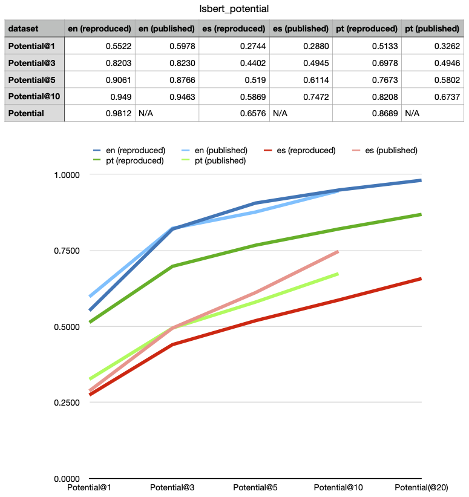

# About this fork

This fork aims to repruduce baselines from [TSAR Shared Task 2022](https://github.com/LaSTUS-TALN-UPF/TSAR-2022-Shared-Task) using a modified version of [BERT-LS](https://github.com/qiang2100/BERT-LS/) (often also referred to as LSBERT) according to information provided by [Štajner+2022](http://arxiv.org/abs/2209.05301).

To rule out differences in ranking/filtering, I do not filter the results and compare only **Potential**.

So far, the results for Spanish and Portuguese diverge substantially from the published ones.

For Spanish, my reproduced **Potential@20 is 0.6576**, while the published **Potential@10 is 0.7472**. That is, even though I am generating 20 candidates, the results are much lower than the published results for top 10 candidates after filtering/reranking.

For Portuguese, it's the other way around, the attempt to reproduce the baseline has much higher potential than the published baseline.

Assuming that the published baseline also generated only 20 candidates (the default parameter value), the discrepancy for both languaes is surprising, and in case of Spanish cannot be explained by reranking/filtering of the results.




I have modified the original implementation of [LSBERT](https://github.com/qiang2100/BERT-LS/) to support TSAR datasets and other BERT models.

Following [Štajner+2022](http://arxiv.org/abs/2209.05301), I use the following parameters/resources:

- BERT models:
  - English: original BERT-WWM, type: BERT-large-wwm, uncased, namely **bert-large-uncased-whole-word-masking**
  - Spanish: "BETO", type: BERT-base-wwm, uncased, namely **dccuchile/bert-base-spanish-wwm-uncased**
  - Portuguese: "BERTimbau", type: BERT-base, cased, namely **neuralmind/bert-large-portuguese-cased**
  
- probability-mask=0.5, max-sequence-length=350

I do not use a stemmer, frequency files, or a FastText model, since I am not filtering/ranking. I generate 20 candidates (default parameter value).

The source code and results are available in this repository:
Interesting files:

  - [LSBert2_adno.py](LSBert2_adno.py) (modification of the original LSBert2.py)
  - [run_LSBert2_adno.sh](LSBert2_adno.py) (shell script for the experiments)
  - [run_eval.sh](run_eval.sh) (shell script for evaluation using a modified TSAR eval script)

  - [tsar_eval_pot.py](tsar_eval_pot.py) (modified TSAR eval script, that outputs full potential)
  - [results/lsbert_potential.tsv](results/lsbert_potential.tsv) – potential table (table and chart in the figure above)

In the table of potential values above, "Potential" is potential of all candidates = Potential@20 (I am generating 20 candidates).


- - -

# Lexical Simplification with Pretrained Encoders

   Lexical simplification (LS) aims to replace complex words in a given sentence with their simpler alternatives of equivalent meaning. Recently unsupervised lexical simplification approaches only rely on the complex word itself regardless of the given sentence to generate candidate substitutions, which will inevitably produce a large number of spurious candidates. We present a simple BERT-based LS approach that makes use of the pre-trained unsupervised deep bidirectional representations BERT. We feed the given sentence masked the complex word into the masking language model of BERT to generate candidate substitutions. By considering the whole sentence, the generated simpler alternatives are easier to hold cohesion and coherence of a sentence. Experimental results show that our approach obtains obvious improvement on standard LS benchmark.
   

## Pre-trained models

- [FastText](https://dl.fbaipublicfiles.com/fasttext/vectors-english/crawl-300d-2M-subword.zip) (word embeddings trained using FastText)
- [BERT based on Pytroch-transformers 1.0](https://github.com/huggingface/pytorch-transformers)

## How to run this code

We recommend Python 3.5 or higher. The model is implemented with PyTorch 1.0.1 using [pytorch-transformers v1.0.0](https://github.com/huggingface/pytorch-transformers). Here, we give three versions: LSBert1.0 and LSBert2.0 need to be privoided with sentence and complex word, recursive_LSBert2 can directly simplify one sentence.

(1) Download pretrianed BERT. In our experiments, we adopted pretrained [BERT-Large, Uncased (Whole Word Masking)](https://storage.googleapis.com/bert_models/2019_05_30/wwm_uncased_L-24_H-1024_A-16.zip).

(2) Download the pre-trained word embeddings using [FastText](https://dl.fbaipublicfiles.com/fasttext/vectors-english/crawl-300d-2M-subword.zip).

### run LSBert1.0 published in [AAAI2020](https://arxiv.org/abs/1907.06226)

(3) run "./run_LSBert1.sh".

### run LSBert2.0 published in [arXiv](https://arxiv.org/abs/2006.14939)

(4) Download an English paraphrase database ([PPDB](http://paraphrase.org/#/download)) , and assign the path of PPDB in the ".sh" file.

(5) Download an pretrained sequence labeling task to [identify complex word ](https://github.com/siangooding/lexical_simplification/blob/master/gpu_attention.model), and put the into the main directory of code.

(6) run "./run_LSBert2.sh".
### run LSBert2.0 to simplify one sentence

(7) run "./run_LSBert_TS.sh": Iteratively call LSBert2.0 to simplify one sentence

## Idea

Suppose that there is a sentence "the cat perched on the mat" and the complex word "perched". We concatenate the original sequence S and S' as a sentence pair, and feed the sentence pair {S,S'} into the BERT to obtain the probability distribution of the vocabulary corresponding to the mask word. Finally, we select as simplification candidates the top words from the probability distribution, excluding the morphological derivations of the complex word. For this example, we can get the top three simplification candidate words "sat, seated, hopped". 

<center style="padding: 40px"></center>

## Example or Advantage

Comparison of simplification candidates of complex words using three methods. Given one sentence "John composed these verses." and complex words 'composed' and 'verses', the top three simplification candidates for each complex word are generated by our method BERT-LS and the state-of-the-art two baselines based word embeddings ([Glavas](https://pdfs.semanticscholar.org/26fb/d19be8e26b42f2d849c1db8a287012bfb188.pdf) and [Paetzold-NE](https://www.aclweb.org/anthology/E17-2006)). The top three substitution candidates generated by BERT-LS are not only related with the complex words, but also can fit for the original sentence very well. Then, by considering the frequency or order of each candidate, we can easily choose 'wrote' as the replacement of 'composed and 'poems' as the replacement of 'verses'. In this case, the simplification sentence 'John wrote these poems.' is more easily understand than the original sentence. 


<center style="padding: 40px"></center>


## Citation

[BERT-LS technical report](https://arxiv.org/pdf/1907.06226.pdf)

```
@article{qiang2020BERTLS,
  title =  {Lexical Simplification with Pretrained Encoders },
  author = {Qiang, Jipeng and 
            Li, Yun and
            Yi, Zhu and
            Yuan, Yunhao and 
            Wu, Xindong},
  journal={Thirty-Fourth AAAI Conference on Artificial Intelligence},
  pages={8649–8656},
  year  =  {2020}
}


